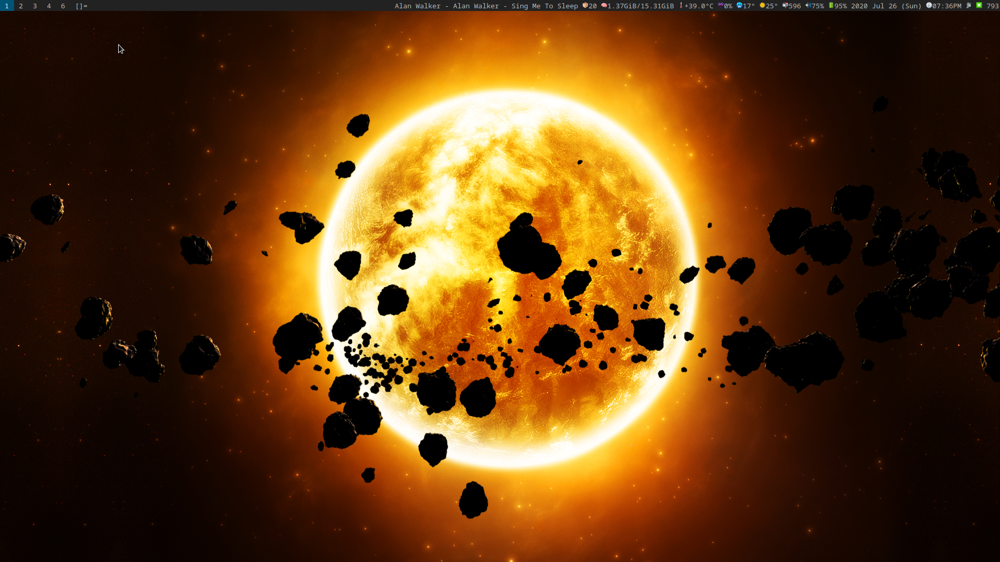
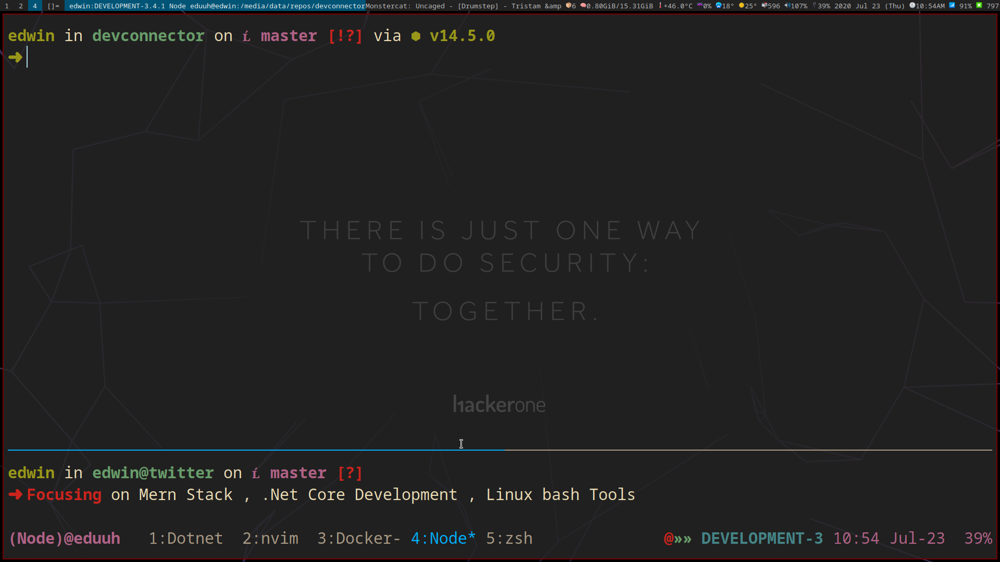
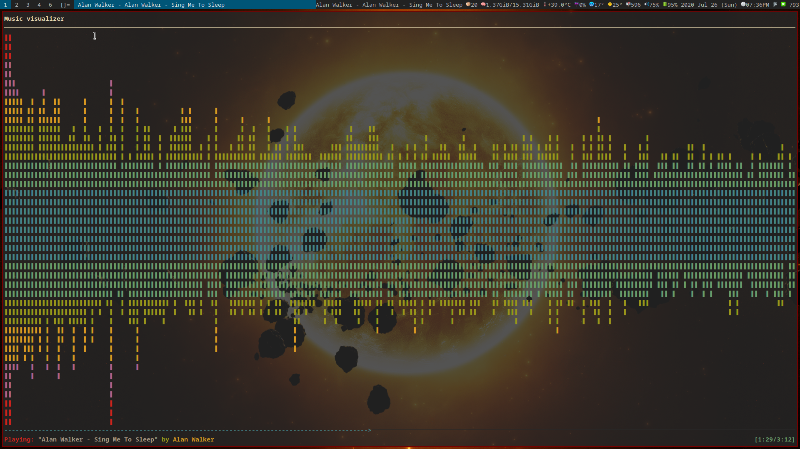

  <!-- PR's Welcome -->
  
  
  

  

 <h1 align="center">Edwin Muraya</h1>

  <strong>(Neo)Vim of the Future</strong>

  A powerful, minimalist development environment with cutting-edge features

 

My personal configs and notes for most programs is use in my development workflows \*and most importantly colemak keybord remaps\*\*. I always try to be consistent on my colemak remaping across programs.

My configs tend to change reqularly. I am always tweaking these, Trying to perfect it to be better as i continue to learning new stuff. I Hope that what I do. 😍

### Colemak and Vim and friends

- **h, j, k, l** - colemak h, n, e and i: movement.
- **k**: next search result.
- **K**: previous search result.
- **u**: go to insert mode.
- **U**: go to insert mode at begging of current line.
- **l**: Insert mode.

### Tools

Includes customizations for the following tools.

1. **zsh** - shell flavored with prezto
2. **tmux** - session management and shell multiplexing
3. **Neovim** - text editing
4. **git** - version control
5. **less** - pager and file viewer
6. **Vimium**. Addd the remaps in (.config/vimium) to brave vimium extension.) options tab in Custom key mapping.
7. **mpd and ncmpcpp** - Music player (client server approach)

##### Less Pager and file viewer (Note)

I added some colemak keybindings in the (~/.lesskey) in the home directory. **Less** uses **lesskey** command/program to change the keybindings.

1. In an open terminal I run (lesskey) command manually which in turn compiled my **.lesskey** config to **.less** config files. (both files are checked out)

#### Displays

